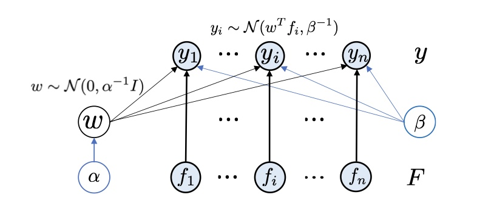
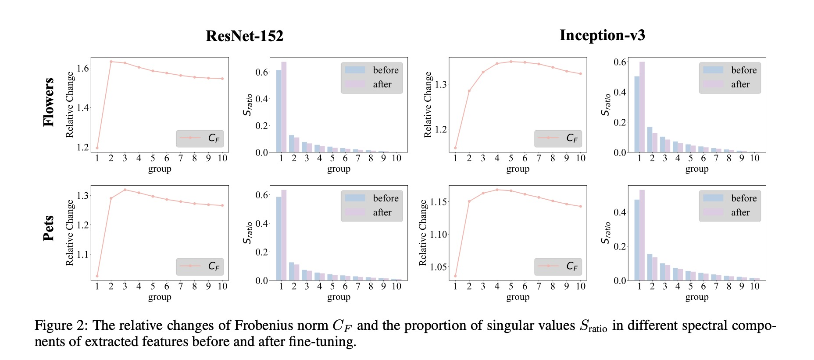
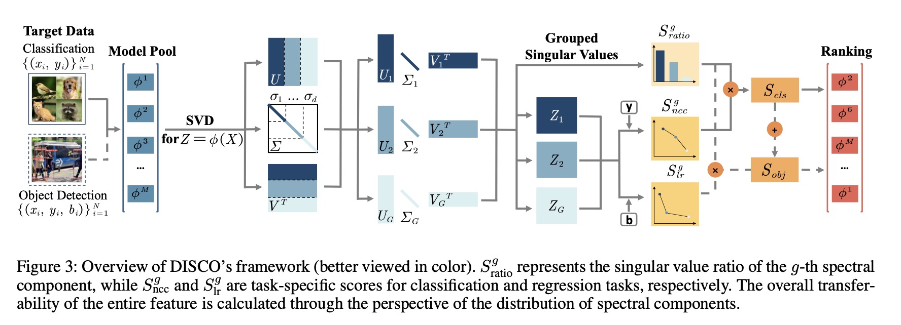

# 如何选取最合适的预训练模型

## 前言
相信很多人在进行研究时都会遇到这样的问题：我有一个数据集，我想利用预训练好的模型对他进行微调，但是预训练模型杂七杂八，有的对数据集好使，有的又不好使。一个一个尝试固然可以，但这样毕竟效率太低，那是否会有一种**评价方法**来体现预训练模型的泛化性、可迁移性等等？换句话说，我们尝试利用一种评价方法，评估预训练后的模型是否在现有的数据集下具有强大的泛化性.
## 起源
### 模型的可迁移性
其实迁移学习一直都算比较有趣的问题，比如domain adaption，domain generalization，test-time adaptation等等。这些方法在机器学习就时常提及，思路的根源在于想让模型在未见过的测试集上同样具有良好的性能，虽然训练过程的验证集指标会帮助我们观察到一些问题，但这不全面，也许模型收敛的很好但测试结果就是很差。

随着可扩展基础模型的发展，这类基础模型具有处理大量数据的能力，一定程度上让模型的**通用性**得到进一步提升。同样的，迁移学习逐渐走向预训练-微调这一基本范式。那像这种预训练好的模型怎么去评估它的优劣呢？

一开始的思路在这篇论文中：[Unsupervised Scalable Representation Learning for Multivariate Time Series](https://arxiv.org/pdf/1901.10738)，这里先不介绍采用的模型和训练方法，主要是它实验中的可迁移性那一部分。

大体实验流程是使用一个编码器在一个数据集上进行训练，学习到一种表示，再将这个编码器学到的表示迁移到其他数据集上。具体来说就是将这些表示输入，并训练一个简单的分类器，去和直接在目标数据集上训练的表示进行比较。实验结果显示两者的表征相近，说明他得到的表示具有可迁移性。

显然，预训练好的表示是高维表征，该实验过程采用比较两种数据集生成的表征是否类似来判断迁移性，那我们以预训练-微调为范式可以怎么想呢？

### 预训练-微调范式
我们将预训练好的模型当作**特征提取器**，在不进行梯度更新时会生成高维表示，用它直接训练下游分类器和直接训练原始数据集相比，如果结果提升明显，大概也可以说明这个模型适合微调。这其实是基础模型的零样本泛化能力（zero-shot），面对我们的个性化数据集，可以非常有效的提取重要特征。

只是这个明显该如何量化呢？直到现在我们也是在凭感觉来说明模型的能力，表征相似到底到什么情况才算相似？提升明显到底提升多少才算明显呢？有趣的是，还真有量化模型能力的方法

## 处理高维表征
### 分析源域和目标域的相关性
源域就是预训练后的模型，目标域就是我们的数据集。这种思路很类似我刚刚说的量化特征提取到底“好”到什么程度，具体做法也很好理解：

* 我们设预训练好的模型为$\textcolor{magenta}{\theta}$，然后将自己的数据集$\textcolor{magenta}{x_i}$喂给他，生成一个假的分布，表示为$\textcolor{magenta}{\theta(x_i)}$
* 自然，这个假分布会生成些假标签$\textcolor{magenta}{y_i}$，假设源任务下的标签分布为$\textcolor{magenta}{z}$，那比较的就是用真分布生成的标签个数和假分布生成的标签个数有多少是匹配上的，换成数学语言表示下：

$$
\textcolor{magenta}{\hat{P}(y, z) = \frac{1}{n} \sum_{i:y_i=y} \theta(x_i)_z}
$$

式子道理很简单，就是求和满足所有$\textcolor{magenta}{y_i=y}$的样本，再归一化；根据这个我们就可以计算出$\textcolor{magenta}{P(z)}$

$$
\textcolor{magenta}{\hat{P}(z) = \sum_{y \in \mathcal{Y}} \hat{P}(y, z) = \frac{1}{n} \sum_{i=1}^{n} \theta(x_i)_z}
$$

这就是全概率公式的应用，表示$\textcolor{magenta}{z}$发生的概率是所有可能的$\textcolor{magenta}{y}$值下$\textcolor{magenta}{z}$发生概率的加权平均；有了这两个，我们就可以计算在原任务标签分布的前提下，生成假标签的概率分布$\textcolor{magenta}{P(y|z)}$了：

$$
\textcolor{magenta}{P(y|z) = \frac{\hat{P}(y, z)}{\hat{P}(z)}}
$$

* 别忘了，我们的目的是在已知自己数据集的情况下，计算对应标签的概率分布，所以我们要计算$\textcolor{magenta}{P(y|x)}$，只是通过预训练好的模型生成假的分布$\textcolor{magenta}{\theta(x_i)}$，然后再计算已知标签分布的前提下，y的概率分布$\textcolor{magenta}{P(y|z)}$，那么直接乘$\textcolor{magenta}{\theta(x_i)}$，就可以得到$\textcolor{magenta}{P(y|x)}$了：

$$
\textcolor{magenta}{p(y|x; \theta, \mathcal{D}) = \sum_{z \in \mathcal{Z}} \hat{P}(y|z) \theta(x)_z}
$$

最后取个对数即可：

$$
\textcolor{magenta}{T(\theta, \mathcal{D}) = \frac{1}{n} \sum_{i=1}^{n} \log \left( \sum_{z \in \mathcal{Z}} \hat{P}(y_i|z) \theta(x_i)_z \right)}
$$

另一思路很像对比损失中的**InfoNCE** （当然它的提出比对比学习要早），起名为NCE。简单来说，它的方法就是得到假分布，根据这个假分布得到假标签，然后和真实标签求$NCE(y|z)$，也就是让相近的标签靠近，不同的标签远离，因此假分布可以这样表示：

$$
\textcolor{magenta}{z_i = argmax \theta(x_i)_z}
$$

总的来说，上述方法是基于**经验分布**的计算，去寻找预训练分布和测试分布之间的相关性，而且必须是监督学习的条件才能计算。当然，这也是受限于时代，随着无监督、自监督学习的盛行，上述方法显然需要改善。于是，比较出名的LogME应运而生。

### LogME——不找最大似然，找边际似然
#### 推导

我们首先定义一些量：特征用$\textcolor{magenta}{f}$表示，标签用$\textcolor{magenta}{y_i}$表示，那么所有特征为$\textcolor{magenta}{F}$，所有标签则为$\textcolor{magenta}{y}$

先前的方法基本要计算概率密度$\textcolor{magenta}{P(y|F)}$，也就是在预训练模型上加个全连接层，通过对数似然等方法，去寻找最好的$\textcolor{magenta}{w^*}$，只是最好的很可能会导致过拟合，所以我们对所有可能的$w$积分，用下式表示：

$$
\textcolor{magenta}{P(y|F) = \int P(y|F, w) P(w) dw}
$$

更具体的思路可以看图：

我们假设$\textcolor{magenta}{w}$服从高斯分布，那么$\textcolor{magenta}{P(w|\alpha) = N(w｜0, \alpha^{-1} I)}$，标签$\textcolor{magenta}{y_i}$服从高斯分布$\textcolor{magenta}{N(w^Tf_i, \beta^{-1})}$，则$\textcolor{magenta}{P(y|F, w, \beta) =\prod_{i=1}^n N(y_i|w^Tf_i, \beta^{-1})}$，那么就可以计算出结果：

$$
\textcolor{magenta}{\begin{split}
p(y|F,\alpha,\beta) &= \int p(w|\alpha) p(y|F,w,\beta) dw \\
&= \int p(w|\alpha) \prod_{i=1}^n p(y_i|f_i,w,\beta) dw \quad \\
&= \left( \dfrac{\beta}{2 \pi} \right)^{\frac{n}{2}} \left( \dfrac{\alpha}{2 \pi} \right)^{\frac{D}{2}} \int e^{-\frac{\alpha}{2} w^T w - \frac{\beta}{2} ||Fw - y||^2} dw
\end{split}}
$$

这里的$\textcolor{magenta}{D}$表示预训练的模型维度

最后对上式求对数即可：

$$
\textcolor{magenta}{\begin{split}
\mathcal{L}(\alpha, \beta) &= \log p(y|F,\alpha,\beta) \\
&= \frac{n}{2} \log \beta + \frac{D}{2} \log \alpha - \frac{n}{2} \log 2 \pi\\
&\quad - \frac{\beta}{2} ||F m - y||^2_2 - \frac{\alpha}{2} m^T m - \frac{1}{2} \log |A|
\end{split}}
$$

但这玩意跳步骤太快，具体是怎么计算出来的呢？我在这里给出更详细的推导过程：

$$
\textcolor{blue}{P(w|\alpha) = N(w｜0, \alpha^{-1} I)= \left( \dfrac{\alpha}{2 \pi} \right)^{\frac{D}{2}} \exp{-\frac{\alpha}{2} w^T w}}
$$


$$
\textcolor{blue}{P(y|F,w,\beta) =\left( \dfrac{\beta}{2 \pi} \right)^{\frac{n}{2}} \exp{(-\frac{\beta}{2}\sum_{i=1}^{n}(y_i-w^Tf_i)^2)}}
$$


$$
\textcolor{blue}{P(y|F,\alpha,\beta) = \int p(w|\alpha) p(y|F,w,\beta) dw = \left( \dfrac{\beta}{2 \pi} \right)^{\frac{n}{2}} \left( \dfrac{\alpha}{2 \pi} \right)^{\frac{D}{2}} \int exp({-\frac{\alpha}{2} w^T w - \frac{\beta}{2}\sum_{i=1}^{n}(y_i-w^Tf_i)^2)} dw}
$$


$$
\textcolor{blue}{\begin{split}
M&=-\frac{\alpha}{2} w^T w - \frac{\beta}{2}\sum_{i=1}^{n}(y_i-w^Tf_i)^2)\\
&= -\frac{\alpha}{2} w^T w - \frac{\beta}{2} \sum_{i=1}^{n}(y_i^2 - 2y_i (w^T f_i) + (w^T f_i)^2)\\
&= -\frac{\alpha}{2} w^T w - \frac{\beta}{2} \sum_{i=1}^{n}y_i^2 - \frac{\beta}{2} \sum_{i=1}^{n} (w^T f_i)^2 + {\beta} \sum_{i=1}^{n} y_i (w^T f_i)\\
&=-\frac{1}{2} w^T (\alpha I + \beta F^T F) w + \beta w^T F^T y-\frac{\beta}{2} ||y||^2\\
\end{split}}
$$

根据高斯积分的性质：

$$
\textcolor{blue}{\int exp({-\frac{1}{2} w^TAw -b^Tw+c)} dw = \left( \dfrac{1}{(2\pi)^D |A|} \right)^{\frac{1}{2}} exp({-\frac{1}{2} b^T A^{-1} b + c})}
$$

代回去即可得到结果：

$$
\textcolor{blue}{p(y|F,\alpha,\beta) = \left( \dfrac{\beta}{2 \pi} \right)^{\frac{n}{2}} \left( \dfrac{\alpha}{2 \pi} \right)^{\frac{D}{2}} \left( \dfrac{1}{(2\pi)^D |A|} \right)^{\frac{1}{2}}exp({-\frac{\beta}{2} ||Fm-y||^2 - \frac{\alpha}{2} m^T m})}
$$


$$
\textcolor{blue}{m=\beta A^-1 F^T y}
$$

最后求对数就可以推导出来了

#### 评估
一番繁琐的推导后，我们求出了结果，但如何进行**评估** 呢？也就是我们该如何确定上面式子中的参数$\textcolor{magenta}{\alpha}$和$\textcolor{magenta}{\beta}$呢？显然，我们要找到$\textcolor{magenta}{\alpha}$和$\textcolor{magenta}{\beta}$的最大值，但上面的式子太过繁杂，我们转而计算$\textcolor{magenta}{m}$和$\textcolor{magenta}{\gamma}$，通过他们之间的关系转而确定$\textcolor{magenta}{\alpha}$和$\textcolor{magenta}{\beta}$

我们定义：

$$
\textcolor{magenta}{\begin{split}
A &= \alpha I + \beta F^T F , m = \beta A^{-1} F^T y , \gamma = \sum_{i=1}^D \dfrac{\beta \sigma_i}{\alpha + \beta \sigma_i} \\
\alpha &\leftarrow \dfrac{\gamma}{m^T m} , \beta \leftarrow \dfrac{n - \gamma}{||F m - y||_2^2}
\end{split}}
$$


这样，就可以通过$\textcolor{magenta}{m}$和$\textcolor{magenta}{\gamma}$计算出$\textcolor{magenta}{\alpha}$和$\textcolor{magenta}{\beta}$了～

当然，原论文[LogME](https://arxiv.org/pdf/2102.11005v1)还有些有趣的小设计，例如为了降低计算复杂度，便引入**奇异值分解**的方法，通过更新奇异值，从而减少计算量；还有对原式归一化除以n等别的小设计……

#### 总结
笔者在第一次读LogME时，也被文章提及的算法深深的吸引到了，事实上，在笔者的实验中，该方法也直观的呈现出了不错的评估效果，无需微调即可直接判断模型的有效性，并随着数据量的增加，分数也呈现上升趋势

但有趣的是，经过微调后的模型，再提取特征后和不微调的结果相同。按理来说微调后模型会更倾向于下游任务，分数应该会变高才对，也许我们应该对**微调** 这件事进行更深入的分析，巧合的是，近期的一篇论文正好提到了这个方向的评估方法。
## 再探预训练-微调范式

先前的方法无论是[LEEP](https://arxiv.org/pdf/2002.12462)还是[LogME](https://arxiv.org/pdf/2102.11005v1)，都是分析预训练模型提取的整体特征的内在特性，或者特征与目标标签的匹配程度，来评估基础模型的有效性。但随着微调方法的扩展和应用，我们更希望找到微调前后，模型会有什么**细粒度的变化**。这正是目前所有评估模型没有考虑到的地方

那我们如何看到微调前后模型的变化情况呢？有个很有趣的方向——**SVD奇异值分解**

这里是[原论文](https://arxiv.org/pdf/2412.19085)

### 微调中的特征变化

我们先定义一些量，便于后续分析：$\textcolor{magenta}{\phi_m}$表示第m个预训练模型，$\textcolor{magenta}{\phi'_m}$表示第m个微调后的模型，$\textcolor{magenta}{Z\in R^{N*d}}$表示预训练模型提取的特征，N是数据集，d是模型维度$\textcolor{magenta}{Z'\in R^{N*d}}$表示微调后的模型提取的特征，接下来我们对提取的特征进行奇异值分解：

$$
\textcolor{magenta}{Z = U \Sigma V^T, Z' = U' \Sigma' V'^T}
$$

我们的目的是将Z分为G组不同的频谱分量，那就要从高到低将奇异值分为G组，每个组有s个连续奇异值，U、V同理，这样第g个特征值分量就是第g组列矩阵$\textcolor{magenta}{U_g}$、对角线$\textcolor{magenta}{\Sigma_g}$和$\textcolor{magenta}{V_g}$的行矩阵进行乘积，就可以得到$\textcolor{magenta}{Z_g}$：

$$
\textcolor{magenta}{Z_g = U_g \Sigma_g V_g^T, Z'_g = U'_g \Sigma'_g V'^T_g}
$$

分割好后，需要一些**评估**特征分量的方法
* 一个是**F范数**，计算特征之间的相对变化：

$$
\textcolor{magenta}{C_F^g = \frac{||Z_g - Z'_g||_F}{||Z_g||_F}}
$$

* 另一个是计算每个特征分量的奇异值$\sigma_g$的**变化率**：

$$
\textcolor{magenta}{S_{\text{ratio}}^g = \frac{\sum_{j=1}^{s} \sigma_j^g}{\sum_{i=1}^{d} \sigma_i}}
$$


经过实验结果可发现，在微调过程中，奇异值的分布更倾向大成分，并且大的奇异值分量变化较小，但在随后的组中（就是划分的G组），变化增加，也就是具有较大奇异值的分量，通常表现出更高的可转移性。

因此，**奇异值在更具有可迁移性的特征成分上，呈现集中分布；这也暗示了整个特征具有更强的迁移性**

基于此，就可以给出崭新的评估模型迁移性的好方法：$\textcolor{magenta}{S_{\text{DISCO}} = \sum_{g=1}^{G} S_{\text{task}}^g * S_{\text{ratio}}^g}$；其中，$\textcolor{magenta}{S_{\text{task}}^g}$表示第g个特征成分在下游任务上的定量迁移能力（下面会详细定义），$\textcolor{magenta}{S_{\text{ratio}}^g}$表示该成分占总体的比例。

### 下游任务的迁移能力
这里贴一张该方法评估模型的流程图：

#### 分类问题
分类问题，就是考察模型区分不能类别的能力，我们假设类别服从**多元高斯分布**，给定来自第g个特征成分的样本$\textcolor{magenta}{x_i}$，特征为$\textcolor{magenta}{Z_{gi}}$，那么该样本属于第c类的概率：

$$
\textcolor{magenta}{P(y = c | \mathbf{z}_i^g) = -\frac{1}{2} (\mathbf{z}_i^g - \boldsymbol{\mu}_c)^\top \boldsymbol{\Lambda}_c^{-1} (\mathbf{z}_i^g - \boldsymbol{\mu}_c) + \log(\pi_c)}
$$

该定义也基本符合LogME的做法，其中$\textcolor{magenta}{\mu_c}$表示第c类的均值，$\textcolor{magenta}{\Lambda_c}$表示第c类的协方差矩阵，$\textcolor{magenta}{\pi_c=N_c/N}$表示第c类样本占总样本的概率

随后使用softmax对所有样本进行归一化：

$$
\textcolor{magenta}{\hat{y}_{i,c}^g = \frac{\exp(\log P(y = c | \mathbf{z}_i^g))}{\sum_{k=1}^{C} \exp(\log P(y = k | \mathbf{z}_i^g))}}
$$

这里的$\textcolor{magenta}{\hat{y}_{i,c}^g}$就是第i个样本属于类别c的概率，最后就可以求和平均得到量分类性能的分数：

$$
\textcolor{magenta}{S_{\text{ncc}}^g = \frac{1}{N} \sum_{i=1}^{N} \mathbf{y}_i^\top \hat{\mathbf{y}}_i^g}
$$

到这里基本就结束啦，比如面对图像分类，或者时间序列背景下的分类问题，就可以计算出分数：

$$
\textcolor{magenta}{\textcolor{magenta}{S_{\text{cls}} = \sum_{g=1}^{G} S_{\text{ncc}}^g * S_{\text{ratio}}^g}}
$$

#### 回归问题
不同于分类问题，回归问题的本质在于预测连续数值，在提取的特征与标签之间建立**线性近似**的关系：$\textcolor{magenta}{||y - \beta z||^2}$，利用**最小二乘法**找到最小的Z，但由于矩阵不可逆，因此可以借用**SVD和伪逆之间的关系**处理：

$$
\textcolor{magenta}{\mathbf{Z} = \mathbf{U}\boldsymbol{\Sigma}\mathbf{V}^\top, \quad \mathbf{Z}^\dagger = \mathbf{V}\boldsymbol{\Sigma}^{-1}\mathbf{U}^\top}
$$

借此，我们直接可以求出$\textcolor{magenta}{\beta = \mathbf{Z}^\dagger \mathbf{y}}$

**tips**：关于伪逆，和SVD与伪逆之间的关系，苏神在之前的博客中给出了非常完美的分析，这里我贴出来：[科学空间](https://spaces.ac.cn/archives/10407)，并且我偷偷猜测下论文作者应该也度过苏神的博客（小声）

常见的目标检测问题，我们定义预测边界框坐标b，类别标签为y，预测的坐标就可以写为$\textcolor{magenta}{\hat{\mathbf{b}} = \mathbf{Z}\hat{\mathbf{Z}}^\dagger \mathbf{b}}$，然后用MSE衡量第g个特征分量真实值与预测之间的差异：

$$
\textcolor{magenta}{S_{\text{lr}}^g = -\frac{1}{K \times 4} \sum_{k=1}^{K} \sum_{j=1}^{4} (b_k^{(j)} - \hat{b}_k^{(j)})^2}
$$

K表示有K个边界框，4表示边界框的四个坐标，最后就可以计算出回归性能的分数：

$$
\textcolor{magenta}{S_{\text{reg}} = \sum_{g=1}^{G} S_{\text{lr}}^g * S_{\text{ratio}}^g}
$$

归一化就使用min-max方法将得分归一化到0-1之间：

$$
\textcolor{magenta}{S_{\text{obj}} = S_{\text{cls}} + S_{\text{reg}}}
$$

### 一些小设计
比如说奇异值分解需要的复杂度较高，可以通过**子采样**的方式找到难以处理的样本，同样也更好的反映出迁移性

具体来说采用了**线性判别分析的方法**进行特征投影，然后从分类器中选择得分最低的几个数据点，作为难以处理的样本

## 反思
其实想做模型评估的工作有段时间了，因为在实际运用预训练模型时，选谁合适选谁不合适一直都难以定义，尤其是如今LLM的实现，让这项工作变得更加复杂。曾经有幸将我的想法和一位老师简单探讨了下，他说这其实是是件不简单的工作，业界似乎也有专门做评估的需要人力进行寻找搜索。

但至少在简单的选择上，这些方法提供了有趣的方向，同时，也帮助我们加深了对于基础模型的认识。
